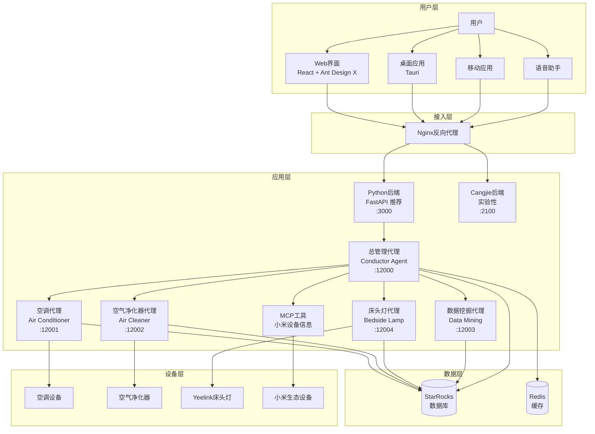
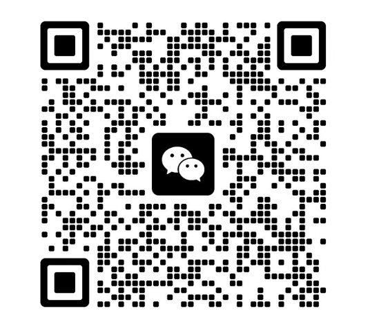

# MOSS AI - 智能家居多Agent协作系统

<div align="center">


**基于LangChain和A2A架构的智能家居多Agent协作系统**

[快速开始](#快速开始) • [功能特性](#功能特性) • [系统架构](#系统架构) • [部署指南](#部署指南) • [API文档](#api文档)

</div>

## 📖 项目简介

MOSS AI是一款创新的智能家居多Agent协作系统，通过多个专业化的AI代理协同工作，为用户提供智能化的家居控制体验。系统采用先进的LangChain框架和A2A（Agent-to-Agent）通信协议，实现设备控制、数据分析、用户行为学习等全方位智能服务。

### 🎯 核心价值

- **🤖 多Agent协作**: 不同专业化的AI代理协同工作，提供专业化服务
- **🧠 智能学习**: 基于用户行为数据，持续学习和优化服务
- **🔗 统一管理**: 通过总管理代理提供统一的智能家居控制接口
- **📊 数据驱动**: 深度挖掘用户习惯，提供个性化建议
- **🐳 容器化部署**: 支持Docker一键部署，简化运维

## ✨ 功能特性

### 🏠 智能设备控制
- **空调控制**: 温度调节、模式切换、电源管理（支持米家空调）
- **空气净化器**: 空气质量监测、净化模式控制、滤网状态管理（基于python-miio）
- **床头灯控制**: 亮度调节、色温设置、颜色控制、场景模式（支持Yeelink床头灯）
- **小米设备集成**: 支持小米生态设备信息查询和Token获取
- **设备联动**: 多设备协同工作，智能场景控制
- **Web界面控制**: 提供直观的Web界面和桌面应用进行设备管理

### 📊 数据分析与洞察
- **用户行为分析**: 深度挖掘使用习惯和偏好模式
- **智能推荐**: 基于历史数据提供个性化设备设置建议
- **使用统计**: 详细的设备使用报告和能耗分析
- **预测服务**: 预测用户需求，提前调整设备状态

### 🔄 多Agent协作
- **总管理代理**: 统一协调所有子代理，提供一站式服务
- **空调代理**: 专业化的空调控制代理，确保精确操作
- **空气净化器代理**: 专门负责空气净化器设备控制
- **床头灯代理**: 控制Yeelink床头灯设备，支持多种场景模式
- **数据挖掘代理**: 专门负责用户行为分析和洞察生成
- **智能路由**: 自动识别用户意图，路由到最合适的代理

### 🛡️ 企业级特性
- **高可用性**: 支持负载均衡和故障转移
- **数据安全**: 完整的操作日志和审计跟踪
- **扩展性**: 模块化设计，易于添加新设备和功能
- **监控告警**: 实时监控系统状态和性能指标
- **MCP工具支持**: 支持Model Context Protocol工具扩展
- **多端应用**: Web端、桌面应用(Tauri 2.0)、移动端支持
- **用户认证**: 支持微信登录和账户管理系统
- **设备绑定**: 支持小米账户绑定和设备Token管理

## 🏗️ 系统架构



### 🔧 技术栈

| 层级 | 技术 | 说明 |
|------|------|------|
| **前端框架** | React 18 + TypeScript | 现代化用户界面开发 |
| **UI组件库** | Ant Design 5 + Ant Design X | 企业级UI组件和AI聊天组件 |
| **样式方案** | Sass/SCSS | 模块化CSS预处理器 |
| **桌面应用** | Tauri 2.0 + Rust | 轻量级跨平台桌面应用框架 |
| **构建工具** | Vite 7 | 极速的前端构建工具 |
| **路由管理** | React Router 7 | 声明式路由解决方案 |
| **后端语言** | Python 3.12 (主要) + Cangjie (实验性) | FastAPI异步服务 + 仓颉编译型语言 |
| **包管理** | uv + pnpm | 快速依赖管理工具 |
| **AI框架** | LangChain + LangGraph | 构建智能Agent工作流 |
| **通信协议** | A2A SDK (Agent-to-Agent) | 标准化代理间通信协议 |
| **大语言模型** | DeepSeek / Google Gemini | 智能对话和决策能力 |
| **数据库** | StarRocks / MySQL | 高性能分析型数据库 |
| **缓存** | Redis | 高速数据缓存 |
| **Web框架** | FastAPI + Uvicorn + Starlette | 高性能异步Web服务 |
| **IoT协议** | python-miio | 小米智能家居设备控制协议 |
| **MCP工具** | FastMCP | Model Context Protocol工具扩展 |
| **容器化** | Docker + Docker Compose | 容器化部署和管理 |
| **反向代理** | Nginx | 负载均衡和SSL终止 |

## 🚀 快速开始

### 环境要求

- **Python**: 3.12+ (推荐使用 uv 进行包管理)
- **Node.js**: 18.0+ (用于前端开发)
- **pnpm**: 9.0+ (推荐的前端包管理器)
- **Rust**: 1.70+ (用于Tauri桌面应用，可选)
- **Cangjie**: 0.1+ (仓颉编译器，实验性功能，不推荐)
- **Docker**: 20.10+ (推荐用于生产部署)
- **Docker Compose**: 2.0+
- **StarRocks/MySQL**: 数据库服务
- **内存**: 至少4GB可用内存
- **存储**: 至少10GB可用空间

### 方式一：Docker部署（推荐）

```bash
# 1. 克隆项目
git clone https://gitee.com/wdep/moss-ai.git
cd moss-ai

```

### 方式二：本地开发部署

#### 1. 安装依赖

```bash
# Python依赖 (推荐使用 uv)
# 安装 uv: https://docs.astral.sh/uv/
uv sync

# 或使用 pip
pip install -r requirements.txt

# 前端依赖
cd app
pnpm install
# 或使用 npm: npm install

# Cangjie后端依赖 (实验性，不推荐)
# 注意：Cangjie后端目前处于实验阶段，功能不完整
cd app/backend-cangjie
cjpm install
```

#### 2. 配置数据库

```bash
# 编辑config.yaml，设置数据库连接
# 根据实际情况配置 StarRocks 或 MySQL 连接信息
vim config.yaml
```

#### 3. 启动服务

```bash
# 方式1：使用脚本启动（推荐）
# Linux/macOS
chmod +x script/start/start_moss_ai.sh
./script/start/start_moss_ai.sh

# Windows PowerShell
.\script\start\start_moss_ai.ps1

# Windows CMD
script\start\start_moss_ai.bat

# 方式2：手动启动各个服务
# 1. 启动Conductor Agent
cd agents/conductor_agent
uv run .
# 或: python -m conductor_agent

# 2. 启动其他Agent (可选)
cd agents/air_conditioner_agent && uv run . &
cd agents/air_cleaner_agent && uv run . &
cd agents/bedside_lamp_agent && uv run . &

# 3. 启动Python后端（推荐）
cd app/backend-python
uv run .
# 或: python -m moss_ai_backend

# 4. 启动前端开发服务器
cd app
pnpm dev

# 5. 启动Cangjie后端 (实验性，不推荐)
# 注意：Cangjie后端功能不完整，仅供实验和研究使用
cd app/backend-cangjie
cjpm build
dist/release/bin/main.exe  # Windows
# 或 ./dist/release/bin/main  # Linux/Mac
```

#### 4. 启动桌面应用（可选）

```bash
cd app
pnpm tauri dev  # 开发模式
# 或
pnpm tauri build  # 构建生产版本
```


## 📚 使用指南

### 基本使用

#### 1. 通过Web界面控制

1. 访问 http://localhost:1420
2. 点击"欢迎"页面进入聊天界面
3. 在聊天框输入指令，如："把空调调到25度"
4. 系统会自动识别意图并执行

```
### 构建指南

## Docker构建

### app构建
```bash
# 进入到app目录
cd moss-ai/app
# 执行build命令
docker build -f app.Dockerfile -t moss-ai-app:latest .
```

### backend构建
```bash
# 进入到app目录
cd moss-ai/app/backend-python
# 执行build命令
docker build -f backend.Dockerfile -t moss-ai-backend:latest .
```

## 🤝 贡献指南

我们欢迎所有形式的贡献！请查看 [CONTRIBUTING.md](CONTRIBUTING.md) 了解详细信息。

### 开发流程

1. Fork 项目
2. 创建功能分支 (`git checkout -b feature/AmazingFeature`)
3. 提交更改 (`git commit -m 'Add some AmazingFeature'`)
4. 推送到分支 (`git push origin feature/AmazingFeature`)
5. 创建 Pull Request

### 代码规范

- 使用 Python Black 进行代码格式化
- 遵循 PEP 8 编码规范
- 添加适当的类型注解
- 编写单元测试

## 📄 许可证

本项目采用 MIT 许可证 - 查看 [LICENSE](LICENSE) 文件了解详细信息。

## 🙏 致谢

- [LangChain](https://github.com/langchain-ai/langchain) - 强大的LLM应用开发框架
- [A2A SDK](https://github.com/a2a-io/a2a-sdk) - Agent间通信协议
- [StarRocks](https://github.com/StarRocks/starrocks) - 高性能分析型数据库
- [DeepSeek](https://www.deepseek.com/) - 优秀的大语言模型服务
- [python-miio](https://github.com/rytilahti/python-miio) - 小米智能家居设备Python控制库

## 📞 联系我们

- **项目主页**: https://gitee.com/wdep/moss-ai
- **问题反馈**: https://gitee.com/wdep/moss-ai/issues
- **邮箱**: chenzhengchen2004@gmail.com
- **微信技术交流群**: 扫描下方二维码加入

<div align="center">


*扫码加入MOSS AI技术交流群*
</div>

## 🔮 路线图

### v1.0.0 (当前版本)
- [x] Python FastAPI后端服务
- [x] React + Ant Design X前端界面
- [x] Tauri 2.0桌面应用
- [x] 多Agent协作系统（LangChain + LangGraph）
- [x] A2A协议通信
- [x] 空调/净化器/床头灯控制
- [x] 微信登录和小米设备绑定
- [ ] Cangjie后端（实验性，功能不完整）

### v1.1.0 (计划中)
- [ ] 完善Python后端功能
- [ ] 支持更多智能设备类型
- [ ] 增加语音控制功能
- [ ] 实现设备联动场景
- [ ] 添加移动端应用
- [ ] 优化Agent协作效率

### v1.2.0 (未来)
- [ ] 支持多用户管理
- [ ] 增强安全认证机制
- [ ] 实现边缘计算支持
- [ ] 添加可视化配置界面
- [ ] 完善Cangjie后端（如果社区有需求）

### v2.0.0 (长期)
- [ ] 支持联邦学习
- [ ] 实现跨平台集成
- [ ] 添加区块链溯源
- [ ] 支持5G和IoT扩展
- [ ] 企业级部署方案

---

<div align="center">

**⭐ 如果这个项目对您有帮助，请给我们一个Star！**

Made with ❤️ by MOSS AI Team

</div>

