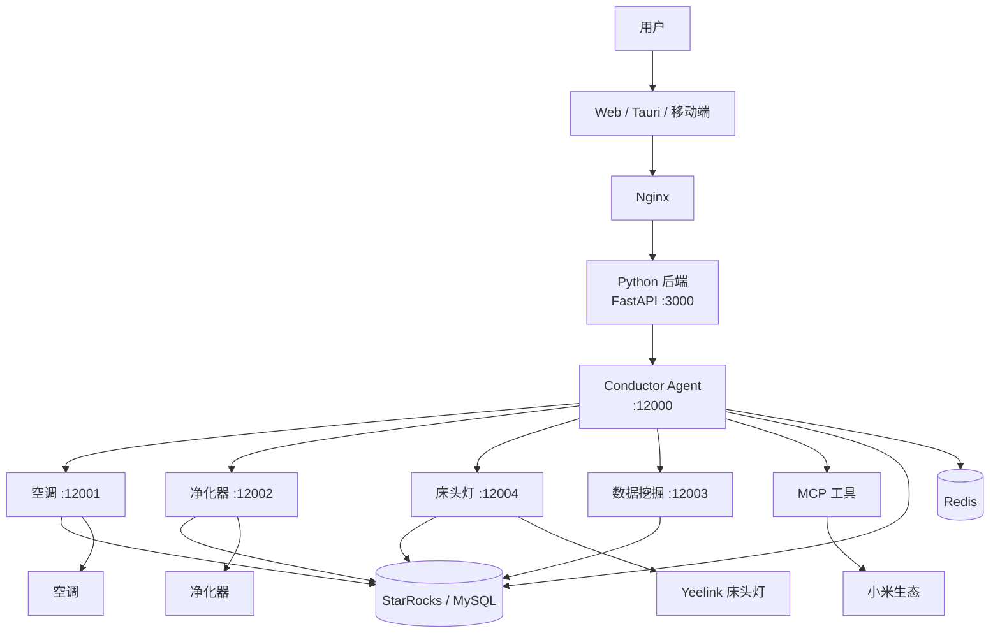

# Smart Home Multi-Agent Collaboration System

<div align="center">


**基于 LangChain 和 A2A 架构的智能家居多 Agent 协作系统**

</div>

## 📖 项目简介

一套基于 LangChain 与 A2A（Agent-to-Agent）协议的智能家居多 Agent 协作系统。多个专业化 Agent 协同工作，覆盖设备控制、数据分析、行为学习等场景，提供统一的对话式智能居家入口。

- **多 Agent 协作**：每个 Agent 专注一类设备/能力，按需调度
- **行为学习**：基于历史数据持续优化个性化服务
- **统一入口**：Conductor Agent 对外单一对话接口，对内分发任务
- **容器化部署**：Docker Compose 一键拉起全部服务

## 🏗️ 系统架构



### 技术栈

| 层级 | 技术 |
|------|------|
| 前端 | React 18 + TypeScript + Ant Design X + Vite 7 |
| 桌面 | Tauri 2.0 + Rust |
| 后端 | Python 3.12 + FastAPI（Cangjie 后端为实验性） |
| AI | LangChain + LangGraph + DeepSeek / Gemini |
| 协议 | A2A SDK + MCP（FastMCP） |
| 数据 | StarRocks / MySQL + Redis |
| IoT | python-miio |
| 部署 | Docker Compose + Nginx |

## 🚀 快速开始

### 环境要求

Python 3.12+、Node.js 18+ / pnpm 9+、Docker 20.10+、StarRocks 或 MySQL、4GB+ 内存。

### Docker 部署（推荐）

```bash
git clone https://github.com/xiaoguos/smart-home-multi-agent-collaboration-system.git
cd smart-home-multi-agent-collaboration-system
# 编辑 config.yaml 配置数据库与 LLM API Key 后，使用 docker-compose 启动
```

### 本地开发

```bash
# 1. 安装依赖
uv sync
cd web && pnpm install

# 2. 配置 config.yaml

# 3. 启动服务
./script/start/start_moss_ai.sh        # Linux/macOS
.\script\start\start_moss_ai.ps1       # Windows

# 或手动逐个启动
cd agents/conductor_agent       && uv run .
cd agents/air_conditioner_agent && uv run . &
cd web/backend-python           && uv run .
cd web                          && pnpm dev
```

访问 `http://localhost:1420`，在聊天框输入指令即可，例如：`把空调调到 25 度`。

## 🐳 Docker 构建

```bash
# 前端
cd web && docker build -f app.Dockerfile -t smart-home-app:latest .

# 后端
cd web/backend-python && docker build -f backend.Dockerfile -t smart-home-backend:latest .
```

## 🤝 贡献

1. Fork 仓库 → 新建分支 → 提交 PR
2. Python 遵循 PEP 8 + Black，TypeScript 遵循 ESLint + Prettier
3. 提交信息遵循 Conventional Commits

## 📄 许可证

MIT — 详见 [LICENSE](LICENSE)。

## 🙏 致谢

[LangChain](https://github.com/langchain-ai/langchain) · [A2A SDK](https://github.com/a2a-io/a2a-sdk) · [StarRocks](https://github.com/StarRocks/starrocks) · [DeepSeek](https://www.deepseek.com/) · [python-miio](https://github.com/rytilahti/python-miio)

---

<div align="center">

**⭐ 如果这个项目对您有帮助，欢迎 Star 支持**

Made with ❤️ by xiaoguos

</div>
