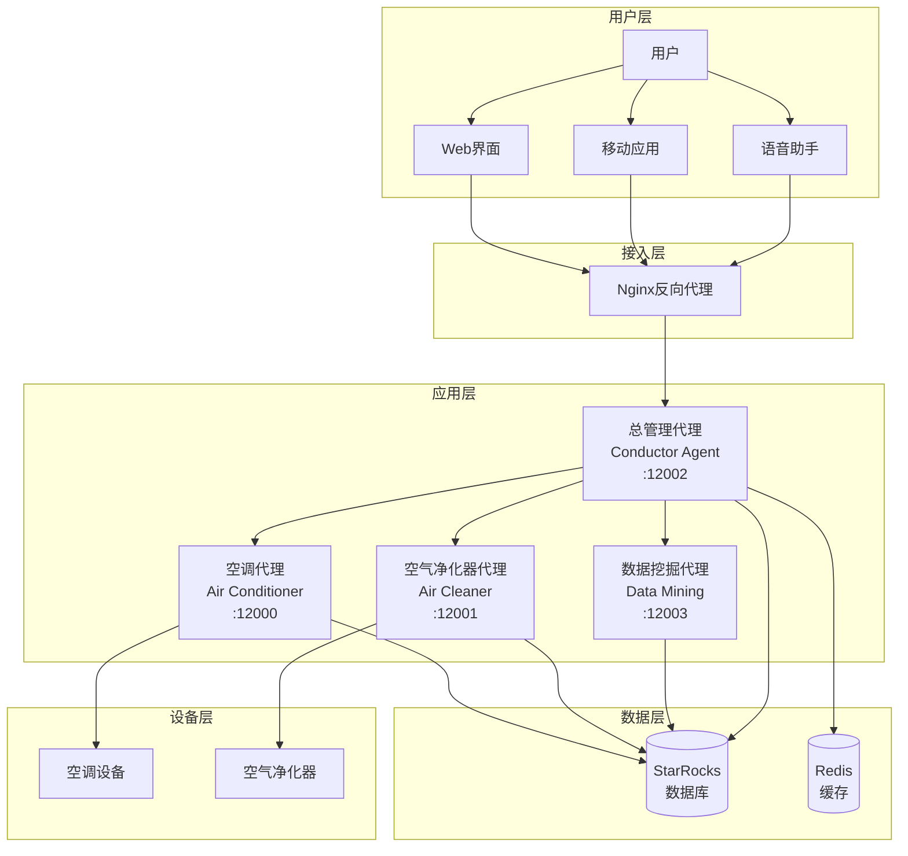

# MOSS AI - 智能家居多Agent协作系统

<div align="center">


**基于LangChain和A2A架构的智能家居多Agent协作系统**

[快速开始](#快速开始) • [功能特性](#功能特性) • [系统架构](#系统架构) • [部署指南](#部署指南) • [API文档](#api文档)

</div>

## 📖 项目简介

MOSS AI是一款创新的智能家居多Agent协作系统，通过多个专业化的AI代理协同工作，为用户提供智能化的家居控制体验。系统采用先进的LangChain框架和A2A（Agent-to-Agent）通信协议，实现设备控制、数据分析、用户行为学习等全方位智能服务。

### 🎯 核心价值

- **🤖 多Agent协作**: 不同专业化的AI代理协同工作，提供专业化服务
- **🧠 智能学习**: 基于用户行为数据，持续学习和优化服务
- **🔗 统一管理**: 通过总管理代理提供统一的智能家居控制接口
- **📊 数据驱动**: 深度挖掘用户习惯，提供个性化建议
- **🐳 容器化部署**: 支持Docker一键部署，简化运维

## ✨ 功能特性

### 🏠 智能设备控制
- **空调控制**: 温度调节、模式切换、电源管理
- **空气净化器**: 空气质量监测、净化模式控制、滤网状态管理
- **设备联动**: 多设备协同工作，智能场景控制

### 📊 数据分析与洞察
- **用户行为分析**: 深度挖掘使用习惯和偏好模式
- **智能推荐**: 基于历史数据提供个性化设备设置建议
- **使用统计**: 详细的设备使用报告和能耗分析
- **预测服务**: 预测用户需求，提前调整设备状态

### 🔄 多Agent协作
- **总管理代理**: 统一协调所有子代理，提供一站式服务
- **设备代理**: 专业化的设备控制代理，确保精确操作
- **数据挖掘代理**: 专门负责用户行为分析和洞察生成
- **智能路由**: 自动识别用户意图，路由到最合适的代理

### 🛡️ 企业级特性
- **高可用性**: 支持负载均衡和故障转移
- **数据安全**: 完整的操作日志和审计跟踪
- **扩展性**: 模块化设计，易于添加新设备和功能
- **监控告警**: 实时监控系统状态和性能指标

## 🏗️ 系统架构



### 🔧 技术栈

| 层级 | 技术 | 说明 |
|------|------|------|
| **AI框架** | LangChain + LangGraph | 构建智能Agent工作流 |
| **通信协议** | A2A (Agent-to-Agent) | 代理间标准化通信 |
| **大语言模型** | DeepSeek | 提供智能对话和决策能力 |
| **数据库** | StarRocks | 高性能分析型数据库 |
| **缓存** | Redis | 高速数据缓存 |
| **Web框架** | FastAPI + Starlette | 高性能异步Web服务 |
| **容器化** | Docker + Docker Compose | 容器化部署和管理 |
| **反向代理** | Nginx | 负载均衡和SSL终止 |

## 🚀 快速开始

### 环境要求

- **Python**: 3.11+
- **Docker**: 20.10+ (推荐)
- **Docker Compose**: 2.0+
- **内存**: 至少4GB可用内存
- **存储**: 至少10GB可用空间

### 方式一：Docker部署（推荐）

```bash
# 1. 克隆项目
git clone https://github.com/your-username/moss-ai.git
cd moss-ai

# 2. 配置数据库连接
cp config.yaml.example config.yaml
# 编辑config.yaml，配置StarRocks连接信息

# 3. 一键部署
# Linux/macOS
chmod +x docker-deploy.sh
./docker-deploy.sh

# Windows
docker-deploy.bat
```

### 方式二：本地开发部署

```bash
# 1. 安装依赖
pip install -r requirements.txt

# 2. 配置数据库
# 编辑config.yaml，设置数据库连接

# 3. 启动服务
# Linux/macOS
chmod +x start_agents.sh
./start_agents.sh

# Windows
start_agents.bat
```

### 验证部署

访问以下地址验证服务是否正常启动：

- **总管理代理**: http://localhost:12002
- **空调代理**: http://localhost:12000
- **空气净化器代理**: http://localhost:12001
- **数据挖掘代理**: http://localhost:12003

## 📚 使用指南

### 基本使用

#### 1. 设备控制
```bash
# 设置空调温度
curl -X POST http://localhost:12002/ \
  -H "Content-Type: application/json" \
  -d '{"message": "把空调调到25度"}'

# 开启空气净化器
curl -X POST http://localhost:12002/ \
  -H "Content-Type: application/json" \
  -d '{"message": "开启空气净化器"}'
```

#### 2. 数据分析
```bash
# 分析使用习惯
curl -X POST http://localhost:12002/ \
  -H "Content-Type: application/json" \
  -d '{"message": "分析我的使用习惯"}'

# 获取个性化建议
curl -X POST http://localhost:12002/ \
  -H "Content-Type: application/json" \
  -d '{"message": "给我一些节能建议"}'
```

### 高级功能

#### 1. 批量操作
```python
import requests

# 批量设置多个设备
devices = [
    {"device": "air_conditioner", "action": "set_temperature", "value": 26},
    {"device": "air_cleaner", "action": "turn_on", "mode": "auto"}
]

for device in devices:
    response = requests.post("http://localhost:12002/", 
                           json={"message": f"控制{device['device']}执行{device['action']}"})
    print(response.json())
```

#### 2. 定时任务
```python
# 设置定时任务
schedule_config = {
    "time": "19:00",
    "action": "set_temperature",
    "device": "air_conditioner",
    "value": 24
}

# 通过总管理代理设置定时任务
requests.post("http://localhost:12002/", 
             json={"message": f"设置定时任务：每天{schedule_config['time']}将空调调到{schedule_config['value']}度"})
```

## 🔧 配置说明

### 数据库配置

编辑 `config.yaml` 文件：

```yaml
database:
  type: "starrocks"  # 支持: sqlite, mysql, postgresql, starrocks
  starrocks:
    host: "localhost"
    port: 9030
    user: "root"
    password: "your_password"
    database: "smart_home"
```

### AI模型配置

```yaml
ai:
  deepseek:
    model: "deepseek-chat"
    api_key: "your_api_key"
    api_base: "https://api.deepseek.com"
    temperature: 0
```

### 代理服务配置

```yaml
agents:
  conductor:
    host: "localhost"
    port: 12002
    enabled: true
  air_conditioner:
    host: "localhost"
    port: 12000
    enabled: true
```

## 📊 API文档

### 总管理代理 API

#### 设备控制
```http
POST /api/control
Content-Type: application/json

{
  "device_type": "air_conditioner",
  "action": "set_temperature",
  "parameters": {"temperature": 25}
}
```

#### 数据分析
```http
POST /api/analyze
Content-Type: application/json

{
  "user_id": "user123",
  "analysis_type": "usage_pattern",
  "time_range": "30d"
}
```

### 数据挖掘代理 API

#### 用户行为分析
```http
POST /api/behavior/analyze
Content-Type: application/json

{
  "user_id": "user123",
  "days": 30
}
```

#### 偏好预测
```http
POST /api/preference/predict
Content-Type: application/json

{
  "user_id": "user123",
  "device_type": "air_conditioner",
  "context": "evening"
}
```

## 🧪 测试

### 运行测试套件

```bash
# 运行所有测试
python -m pytest tests/

# 运行特定测试
python -m pytest tests/test_conductor_agent.py

# 运行集成测试
python agents/test_integrated_system.py
```

### 性能测试

```bash
# 使用Apache Bench进行压力测试
ab -n 1000 -c 10 http://localhost:12002/health

# 使用wrk进行性能测试
wrk -t12 -c400 -d30s http://localhost:12002/health
```

## 📈 监控和运维

### 健康检查

```bash
# 检查服务状态
curl http://localhost:12002/health

# 检查数据库连接
curl http://localhost:12002/api/database/status
```

### 日志查看

```bash
# Docker环境
docker-compose logs -f smart-home-agents

# 本地环境
tail -f logs/conductor_agent.log
```

### 性能监控

```bash
# 查看容器资源使用
docker stats

# 查看系统指标
curl http://localhost:9090/metrics
```

## 🤝 贡献指南

我们欢迎所有形式的贡献！请查看 [CONTRIBUTING.md](CONTRIBUTING.md) 了解详细信息。

### 开发流程

1. Fork 项目
2. 创建功能分支 (`git checkout -b feature/AmazingFeature`)
3. 提交更改 (`git commit -m 'Add some AmazingFeature'`)
4. 推送到分支 (`git push origin feature/AmazingFeature`)
5. 创建 Pull Request

### 代码规范

- 使用 Python Black 进行代码格式化
- 遵循 PEP 8 编码规范
- 添加适当的类型注解
- 编写单元测试

## 📄 许可证

本项目采用 MIT 许可证 - 查看 [LICENSE](LICENSE) 文件了解详细信息。

## 🙏 致谢

- [LangChain](https://github.com/langchain-ai/langchain) - 强大的LLM应用开发框架
- [A2A SDK](https://github.com/a2a-io/a2a-sdk) - Agent间通信协议
- [StarRocks](https://github.com/StarRocks/starrocks) - 高性能分析型数据库
- [DeepSeek](https://www.deepseek.com/) - 优秀的大语言模型服务

## 📞 联系我们

- **项目主页**: https://github.com/your-username/moss-ai
- **问题反馈**: https://github.com/your-username/moss-ai/issues
- **邮箱**: moss-ai@example.com
- **微信群**: 扫描二维码加入技术交流群

## 🔮 路线图

### v1.1.0 (计划中)
- [ ] 支持更多智能设备类型
- [ ] 增加语音控制功能
- [ ] 实现设备联动场景
- [ ] 添加移动端应用

### v1.2.0 (未来)
- [ ] 支持多用户管理
- [ ] 增加安全认证机制
- [ ] 实现边缘计算支持
- [ ] 添加可视化配置界面

### v2.0.0 (长期)
- [ ] 支持联邦学习
- [ ] 实现跨平台集成
- [ ] 添加区块链溯源
- [ ] 支持5G和IoT扩展

---

<div align="center">

**⭐ 如果这个项目对您有帮助，请给我们一个Star！**

Made with ❤️ by MOSS AI Team

</div>
