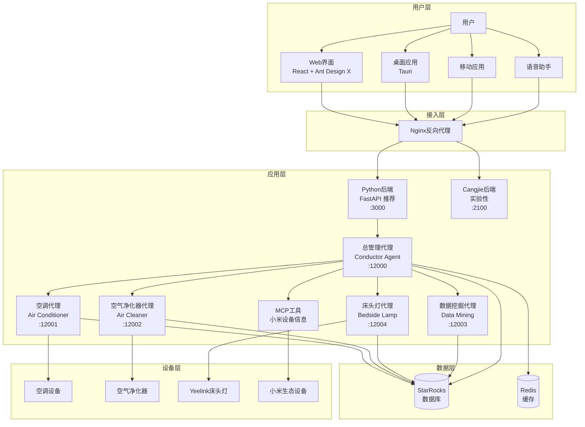

# MOSS AI - 智能家居多Agent协作系统

<div align="center">


**基于LangChain和A2A架构的智能家居多Agent协作系统**

[快速开始](#快速开始) • [功能特性](#功能特性) • [系统架构](#系统架构) • [部署指南](#部署指南) • [API文档](#api文档)

</div>

## 📖 项目简介

MOSS AI是一款创新的智能家居多Agent协作系统，通过多个专业化的AI代理协同工作，为用户提供智能化的家居控制体验。系统采用先进的LangChain框架和A2A（Agent-to-Agent）通信协议，实现设备控制、数据分析、用户行为学习等全方位智能服务。

### 🎯 核心价值

- **🤖 多Agent协作**: 不同专业化的AI代理协同工作，提供专业化服务
- **🧠 智能学习**: 基于用户行为数据，持续学习和优化服务
- **🔗 统一管理**: 通过总管理代理提供统一的智能家居控制接口
- **📊 数据驱动**: 深度挖掘用户习惯，提供个性化建议
- **🐳 容器化部署**: 支持Docker一键部署，简化运维

## ✨ 功能特性

### 🏠 智能设备控制
- **空调控制**: 温度调节、模式切换、电源管理（支持米家空调）
- **空气净化器**: 空气质量监测、净化模式控制、滤网状态管理（基于python-miio）
- **床头灯控制**: 亮度调节、色温设置、颜色控制、场景模式（支持Yeelink床头灯）
- **小米设备集成**: 支持小米生态设备信息查询和Token获取
- **设备联动**: 多设备协同工作，智能场景控制
- **Web界面控制**: 提供直观的Web界面和桌面应用进行设备管理

### 📊 数据分析与洞察
- **用户行为分析**: 深度挖掘使用习惯和偏好模式
- **智能推荐**: 基于历史数据提供个性化设备设置建议
- **使用统计**: 详细的设备使用报告和能耗分析
- **预测服务**: 预测用户需求，提前调整设备状态

### 🔄 多Agent协作
- **总管理代理**: 统一协调所有子代理，提供一站式服务
- **空调代理**: 专业化的空调控制代理，确保精确操作
- **空气净化器代理**: 专门负责空气净化器设备控制
- **床头灯代理**: 控制Yeelink床头灯设备，支持多种场景模式
- **数据挖掘代理**: 专门负责用户行为分析和洞察生成
- **智能路由**: 自动识别用户意图，路由到最合适的代理

### 🛡️ 企业级特性
- **高可用性**: 支持负载均衡和故障转移
- **数据安全**: 完整的操作日志和审计跟踪
- **扩展性**: 模块化设计，易于添加新设备和功能
- **监控告警**: 实时监控系统状态和性能指标
- **MCP工具支持**: 支持Model Context Protocol工具扩展
- **多端应用**: Web端、桌面应用(Tauri 2.0)、移动端支持
- **用户认证**: 支持微信登录和账户管理系统
- **设备绑定**: 支持小米账户绑定和设备Token管理

## 🏗️ 系统架构



### 🔧 技术栈

| 层级 | 技术 | 说明 |
|------|------|------|
| **前端框架** | React 18 + TypeScript | 现代化用户界面开发 |
| **UI组件库** | Ant Design 5 + Ant Design X | 企业级UI组件和AI聊天组件 |
| **样式方案** | Sass/SCSS | 模块化CSS预处理器 |
| **桌面应用** | Tauri 2.0 + Rust | 轻量级跨平台桌面应用框架 |
| **构建工具** | Vite 7 | 极速的前端构建工具 |
| **路由管理** | React Router 7 | 声明式路由解决方案 |
| **后端语言** | Python 3.12 (主要) + Cangjie (实验性) | FastAPI异步服务 + 仓颉编译型语言 |
| **包管理** | uv + pnpm | 快速依赖管理工具 |
| **AI框架** | LangChain + LangGraph | 构建智能Agent工作流 |
| **通信协议** | A2A SDK (Agent-to-Agent) | 标准化代理间通信协议 |
| **大语言模型** | DeepSeek / Google Gemini | 智能对话和决策能力 |
| **数据库** | StarRocks / MySQL | 高性能分析型数据库 |
| **缓存** | Redis | 高速数据缓存 |
| **Web框架** | FastAPI + Uvicorn + Starlette | 高性能异步Web服务 |
| **IoT协议** | python-miio | 小米智能家居设备控制协议 |
| **MCP工具** | FastMCP | Model Context Protocol工具扩展 |
| **容器化** | Docker + Docker Compose | 容器化部署和管理 |
| **反向代理** | Nginx | 负载均衡和SSL终止 |

## 🚀 快速开始

### 环境要求

- **Python**: 3.12+ (推荐使用 uv 进行包管理)
- **Node.js**: 18.0+ (用于前端开发)
- **pnpm**: 9.0+ (推荐的前端包管理器)
- **Rust**: 1.70+ (用于Tauri桌面应用，可选)
- **Cangjie**: 0.1+ (仓颉编译器，实验性功能，不推荐)
- **Docker**: 20.10+ (推荐用于生产部署)
- **Docker Compose**: 2.0+
- **StarRocks/MySQL**: 数据库服务
- **内存**: 至少4GB可用内存
- **存储**: 至少10GB可用空间

### 方式一：Docker部署（推荐）

```bash
# 1. 克隆项目
git clone https://gitee.com/wdep/moss-ai.git
cd moss-ai

# 2. 配置数据库连接
cp config.yaml.example config.yaml
# 编辑config.yaml，配置StarRocks连接信息

# 3. 一键部署
# Linux/macOS
chmod +x docker-deploy.sh
./docker-deploy.sh

# Windows
docker-deploy.bat
```

### 方式二：本地开发部署

#### 1. 安装依赖

```bash
# Python依赖 (推荐使用 uv)
# 安装 uv: https://docs.astral.sh/uv/
uv sync

# 或使用 pip
pip install -r requirements.txt

# 前端依赖
cd app
pnpm install
# 或使用 npm: npm install

# Cangjie后端依赖 (实验性，不推荐)
# 注意：Cangjie后端目前处于实验阶段，功能不完整
cd app/backend-cangjie
cjpm install
```

#### 2. 配置数据库

```bash
# 编辑config.yaml，设置数据库连接
# 根据实际情况配置 StarRocks 或 MySQL 连接信息
vim config.yaml
```

#### 3. 启动服务

```bash
# 方式1：使用脚本启动（推荐）
# Linux/macOS
chmod +x script/start/start_moss_ai.sh
./script/start/start_moss_ai.sh

# Windows PowerShell
.\script\start\start_moss_ai.ps1

# Windows CMD
script\start\start_moss_ai.bat

# 方式2：手动启动各个服务
# 1. 启动Conductor Agent
cd agents/conductor_agent
uv run .
# 或: python -m conductor_agent

# 2. 启动其他Agent (可选)
cd agents/air_conditioner_agent && uv run . &
cd agents/air_cleaner_agent && uv run . &
cd agents/bedside_lamp_agent && uv run . &

# 3. 启动Python后端（推荐）
cd app/backend-python
uv run .
# 或: python -m moss_ai_backend

# 4. 启动前端开发服务器
cd app
pnpm dev

# 5. 启动Cangjie后端 (实验性，不推荐)
# 注意：Cangjie后端功能不完整，仅供实验和研究使用
cd app/backend-cangjie
cjpm build
dist/release/bin/main.exe  # Windows
# 或 ./dist/release/bin/main  # Linux/Mac
```

#### 4. 启动桌面应用（可选）

```bash
cd app
pnpm tauri dev  # 开发模式
# 或
pnpm tauri build  # 构建生产版本
```

### 验证部署

访问以下地址验证服务是否正常启动：

### 核心服务（必需）

- **前端界面**: http://localhost:1420 (Vite开发模式)
- **Python后端服务** (推荐): http://localhost:3000
  - API文档: http://localhost:3000/docs
  - ReDoc: http://localhost:3000/redoc
- **总管理代理**: http://localhost:12000
  - 健康检查: http://localhost:12000/health

### Agent服务

- **空调代理**: http://localhost:12001
- **空气净化器代理**: http://localhost:12002
- **床头灯代理**: http://localhost:12004
- **数据挖掘代理**: http://localhost:12003 (按需启动)

### 可选服务

- **Cangjie后端** (实验性): http://localhost:2100
  - ⚠️ 警告：功能不完整，不推荐使用
- **桌面应用**: 通过 `pnpm tauri dev` 启动

## 📚 使用指南

### 基本使用

#### 1. 通过Web界面控制 (推荐)

1. 访问 http://localhost:1420
2. 点击"欢迎"页面进入聊天界面
3. 在聊天框输入指令，如："把空调调到25度"
4. 系统会自动识别意图并执行

#### 2. 通过API控制

```bash
# 通过Python后端发送消息
curl -X POST http://localhost:3000/api/chat \
  -H "Content-Type: application/json" \
  -d '{
    "query": "把空调调到25度",
    "context_id": "user_session_123"
  }'

# 直接调用Conductor Agent (A2A协议)
curl -X POST http://localhost:12000/send_message \
  -H "Content-Type: application/json" \
  -d '{
    "context_id": "session_123",
    "role": "user",
    "parts": [{"kind": "text", "text": "开启空气净化器"}],
    "message_id": "msg_001"
  }'

# 获取配置信息
curl http://localhost:3000/api/config
```

#### 3. 用户认证与设备绑定

```bash
# 微信登录 - 在Web界面进入账户设置页面
# 访问: http://localhost:1420/account-setting

# 绑定小米账户 - 在设置页面进行小米设备绑定
# 访问: http://localhost:1420/xiaomi-binding

# 获取小米设备列表
curl -X GET http://localhost:3000/api/xiaomi/devices \
  -H "Authorization: Bearer <token>"
```

#### 4. 设备控制示例

```bash
# 控制空调
"把空调调到25度" 
"打开空调制冷模式"
"关闭空调"

# 控制空气净化器
"开启空气净化器"
"设置净化器为睡眠模式"
"查询空气质量"

# 控制床头灯
"打开床头灯"
"设置床头灯亮度为50%"
"床头灯设置为阅读模式"
```

### 高级功能

#### 1. Agent间通信 (A2A协议)

系统使用A2A SDK实现Agent间的标准化通信：

```python
from a2a_sdk import A2AMessage

# 创建A2A消息
message = A2AMessage(
    context_id="session_123",
    role="user",
    parts=[{"kind": "text", "text": "把空调调到25度"}],
    message_id="msg_001"
)

# 发送到Conductor Agent
response = requests.post(
    "http://localhost:12000/send_message",
    json=message.dict()
)
```

#### 2. 使用MCP工具获取小米设备信息

```python
import asyncio
from mcp.xiaomi_device_mcp import get_xiaomi_devices

async def get_devices():
    result = await get_xiaomi_devices(
        username="your_email@example.com",
        password="your_password",
        server="cn"
    )
    print(result)

asyncio.run(get_devices())
```

#### 3. 桌面应用开发

```bash
# 开发模式
cd app
pnpm tauri dev

# 构建生产版本
pnpm tauri build

# 构建特定平台
pnpm tauri build --target x86_64-pc-windows-msvc  # Windows
pnpm tauri build --target x86_64-apple-darwin     # macOS
pnpm tauri build --target x86_64-unknown-linux-gnu # Linux
```

## 🔧 配置说明

### 数据库配置

编辑项目根目录的 `config.yaml` 文件：

```yaml
database:
  type: "starrocks"  # 支持: starrocks, mysql, sqlite
  
  starrocks:
    host: "192.168.110.124"
    port: 9030
    user: "root"
    password: "123456"
    database: "smart_home"
    charset: "utf8mb4"
    
    # 连接池配置
    pool_size: 10
    max_overflow: 20
    pool_timeout: 30
    pool_recycle: 3600
```

### 后端服务配置

> **⚠️ 重要提示**: 推荐使用 **Python FastAPI 后端** (端口3000)，Cangjie后端目前处于实验阶段，功能不完整，不建议在生产环境使用。

```yaml
backend:
  # Python FastAPI 后端（推荐）
  python:
    host: "0.0.0.0"
    port: 3000
    debug: true
    environment: "development"
    
    # Conductor Agent 连接配置
    conductor_agent_url: "http://localhost:12000"
    conductor_timeout: 120  # 秒
    
    # CORS 配置
    cors_origins:
      - "http://localhost:1420"   # Vite 前端
      - "http://127.0.0.1:1420"
      - "tauri://localhost"       # Tauri 应用
  
  # Cangjie 后端配置（实验性，不推荐使用）
  cangjie:
    host: "127.0.0.1"
    port: 2100
    enabled: false  # 默认禁用
```

### Agent代理配置

```yaml
agents:
  conductor:
    host: "localhost"
    port: 12000
    name: "Conductor Agent"
    description: "智能家居总管理助手"
    
  air_conditioner:
    host: "localhost"
    port: 12001
    name: "Air Conditioner Agent"
    
  air_cleaner:
    host: "localhost"
    port: 12002
    name: "Air Cleaner Agent"
    
  bedside_lamp:
    host: "localhost"
    port: 12004
    name: "Bedside Lamp Agent"
```

### 前端配置

```yaml
frontend:
  dev_server:
    host: "localhost"
    port: 1420
    
  tauri:
    enabled: true
```

### 日志配置

```yaml
logging:
  level: "INFO"
  format: "%(asctime)s - %(name)s - %(levelname)s - %(message)s"
  
  file:
    enabled: true
    directory: "logs"
    max_bytes: 10485760  # 10MB
    backup_count: 5
```

## 📊 API文档

### Python后端 API (端口: 3000)

完整的API文档访问: http://localhost:3000/docs

#### 聊天接口
```http
POST /api/chat
Content-Type: application/json

{
  "query": "把空调调到25度",
  "context_id": "user_session_123"
}
```

**响应示例**:
```json
{
  "response": "好的，我已经将空调温度调整到25度",
  "context_id": "user_session_123",
  "timestamp": "2025-01-01T12:00:00Z"
}
```

#### 配置接口
```http
GET /api/config
```

#### 用户认证接口
```http
POST /api/auth/wechat/login
POST /api/auth/wechat/callback
GET /api/auth/user
```

#### 小米设备接口
```http
POST /api/xiaomi/bind
GET /api/xiaomi/devices
DELETE /api/xiaomi/unbind
```

### Conductor Agent API (端口: 12000)

#### A2A协议通信 (推荐)
```http
POST /send_message
Content-Type: application/json

{
  "context_id": "session_123",
  "role": "user",
  "parts": [
    {
      "kind": "text",
      "text": "把空调调到25度"
    }
  ],
  "message_id": "msg_001"
}
```

#### 健康检查
```http
GET /health
```

**响应示例**:
```json
{
  "status": "healthy",
  "agent": "Conductor Agent",
  "version": "0.1.0"
}
```

### 子Agent API

所有子Agent都支持相同的A2A协议接口：

- **空调代理** (12001): `/send_message`
- **空气净化器代理** (12002): `/send_message`
- **床头灯代理** (12004): `/send_message`

### MCP工具

#### 小米设备信息获取
```python
from mcp.xiaomi_device_mcp import get_xiaomi_devices

# 获取设备列表和Token
result = await get_xiaomi_devices(
    username="your_email@example.com",
    password="your_password",
    server="cn"  # 服务器区域: cn, de, i2, ru, sg, us
)
```

### 各服务端口列表

| 服务名称 | 端口 | 状态 | 说明 |
|---------|------|------|------|
| Python后端 (FastAPI) | 3000 | ✅ 推荐 | 主要后端服务，提供API接口 |
| 总管理代理 (Conductor) | 12000 | ✅ 必需 | 统一协调所有子代理 |
| 空调代理 (Air Conditioner) | 12001 | ✅ 推荐 | 空调设备控制 |
| 空气净化器代理 (Air Cleaner) | 12002 | ✅ 推荐 | 空气净化器控制 |
| 床头灯代理 (Bedside Lamp) | 12004 | ✅ 推荐 | 床头灯设备控制 |
| 数据挖掘代理 (Data Mining) | 12003 | 📋 可选 | 用户行为分析 |
| Cangjie后端服务 | 2100 | ⚠️ 实验性 | 不推荐使用，功能不完整 |
| 前端开发服务器 (Vite) | 1420 | ✅ 必需 | React开发服务器 |

## 🧪 测试

### 运行测试套件

```bash
# 运行所有测试
python -m pytest tests/

# 运行特定测试
python -m pytest tests/test_conductor_agent.py

# 运行集成测试
python agents/test_integrated_system.py
```

### 性能测试

```bash
# 使用Apache Bench进行压力测试
ab -n 1000 -c 10 http://localhost:12000/health

# 使用wrk进行性能测试
wrk -t12 -c400 -d30s http://localhost:12000/health
```

## 📈 监控和运维

### 健康检查

```bash
# 检查Python后端服务（推荐）
curl http://localhost:3000/api/config

# 查看API文档
curl http://localhost:3000/docs

# 检查Conductor Agent状态
curl http://localhost:12000/health

# 检查前端服务
curl http://localhost:1420

# 检查Cangjie后端（不推荐使用）
curl http://localhost:2100/health
```

### 日志查看

```bash
# Docker环境
docker-compose logs -f smart-home-agents

# 本地环境 - 查看不同服务日志
tail -f logs/conductor_agent.log      # Conductor Agent
tail -f logs/backend.log               # Python后端

# 查看所有日志
tail -f logs/*.log
```

### 性能监控

```bash
# 查看容器资源使用
docker stats

# 查看系统指标
curl http://localhost:9090/metrics
```

## 🤝 贡献指南

我们欢迎所有形式的贡献！请查看 [CONTRIBUTING.md](CONTRIBUTING.md) 了解详细信息。

### 开发流程

1. Fork 项目
2. 创建功能分支 (`git checkout -b feature/AmazingFeature`)
3. 提交更改 (`git commit -m 'Add some AmazingFeature'`)
4. 推送到分支 (`git push origin feature/AmazingFeature`)
5. 创建 Pull Request

### 代码规范

- 使用 Python Black 进行代码格式化
- 遵循 PEP 8 编码规范
- 添加适当的类型注解
- 编写单元测试

## 📄 许可证

本项目采用 MIT 许可证 - 查看 [LICENSE](LICENSE) 文件了解详细信息。

## 🙏 致谢

- [LangChain](https://github.com/langchain-ai/langchain) - 强大的LLM应用开发框架
- [A2A SDK](https://github.com/a2a-io/a2a-sdk) - Agent间通信协议
- [StarRocks](https://github.com/StarRocks/starrocks) - 高性能分析型数据库
- [DeepSeek](https://www.deepseek.com/) - 优秀的大语言模型服务
- [python-miio](https://github.com/rytilahti/python-miio) - 小米智能家居设备Python控制库

## 📞 联系我们

- **项目主页**: https://gitee.com/wdep/moss-ai
- **问题反馈**: https://gitee.com/wdep/moss-ai/issues
- **邮箱**: chenzhengchen2004@gmail.com
- **微信技术交流群**: 扫描下方二维码加入

<div align="center">


*扫码加入MOSS AI技术交流群*
</div>

## 🔮 路线图

### v1.0.0 (当前版本)
- [x] Python FastAPI后端服务
- [x] React + Ant Design X前端界面
- [x] Tauri 2.0桌面应用
- [x] 多Agent协作系统（LangChain + LangGraph）
- [x] A2A协议通信
- [x] 空调/净化器/床头灯控制
- [x] 微信登录和小米设备绑定
- [ ] Cangjie后端（实验性，功能不完整）

### v1.1.0 (计划中)
- [ ] 完善Python后端功能
- [ ] 支持更多智能设备类型
- [ ] 增加语音控制功能
- [ ] 实现设备联动场景
- [ ] 添加移动端应用
- [ ] 优化Agent协作效率

### v1.2.0 (未来)
- [ ] 支持多用户管理
- [ ] 增强安全认证机制
- [ ] 实现边缘计算支持
- [ ] 添加可视化配置界面
- [ ] 完善Cangjie后端（如果社区有需求）

### v2.0.0 (长期)
- [ ] 支持联邦学习
- [ ] 实现跨平台集成
- [ ] 添加区块链溯源
- [ ] 支持5G和IoT扩展
- [ ] 企业级部署方案

---

<div align="center">

**⭐ 如果这个项目对您有帮助，请给我们一个Star！**

Made with ❤️ by MOSS AI Team

</div>

