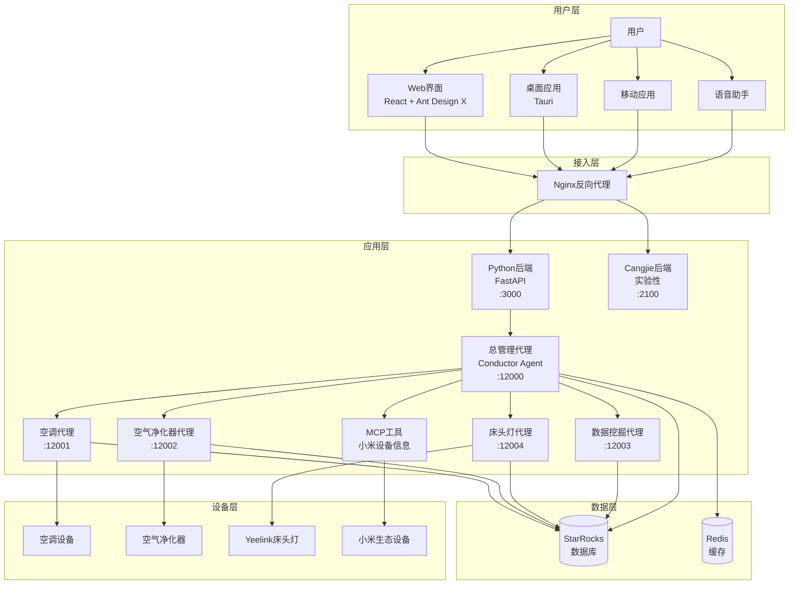

# Smart Home Multi-Agent Collaboration System

<div align="center">


**基于 LangChain 和 A2A 架构的智能家居多 Agent 协作系统**

[快速开始](#-快速开始) · [功能特性](#-功能特性) · [系统架构](#-系统架构) · [部署指南](#-部署指南)

</div>

## 📖 项目简介

Smart Home Multi-Agent Collaboration System 是一套基于 LangChain 与 A2A（Agent-to-Agent）协议的智能家居多 Agent 协作系统。多个专业化 AI Agent 协同工作，覆盖设备控制、数据分析、用户行为学习等场景，提供统一的对话式智能居家入口。

### 🎯 核心价值

- **🤖 多 Agent 协作**：每个 Agent 专注一类设备/能力，按需调度、各司其职
- **🧠 行为学习**：基于历史数据持续优化个性化服务
- **🔗 统一入口**：总管理 Agent 对外提供单一对话接口，对内分发任务
- **📊 数据驱动**：数据挖掘 Agent 深度分析使用习惯并给出建议
- **🐳 容器化部署**：Docker Compose 一键拉起全部服务

## ✨ 功能特性

### 🏠 智能设备控制
- **空调 Agent**：温度调节、模式切换、电源管理（米家空调）
- **空气净化器 Agent**：空气质量监测、净化模式、滤网状态（python-miio）
- **床头灯 Agent**：亮度、色温、颜色、场景模式（Yeelink 床头灯）
- **MCP 工具扩展**：支持小米生态设备信息查询与 Token 管理
- **Web / 桌面 / 移动多端**：React Web、Tauri 桌面应用

### 📊 数据分析与洞察
- 用户行为模式挖掘与偏好画像
- 个性化设备设置建议
- 设备使用统计与能耗分析
- 基于历史行为的预测性调整

### 🔄 多 Agent 协作
- **Conductor Agent**：总管理，意图识别与任务分发
- **Air Conditioner Agent**：空调设备控制
- **Air Cleaner Agent**：空气净化器控制
- **Bedside Lamp Agent**：床头灯控制
- **Data Mining Agent**：行为分析与洞察
- 智能路由：自动匹配最合适的 Agent

### 🛡️ 工程特性
- 模块化设计，新增设备 Agent 即插即用
- 完整操作日志与审计跟踪
- Docker Compose 编排，生产环境友好
- MCP（Model Context Protocol）工具扩展
- 微信登录 + 小米账户绑定

## 🏗️ 系统架构



### 🔧 技术栈

| 层级 | 技术 | 说明 |
|------|------|------|
| 前端框架 | React 18 + TypeScript | 现代化用户界面 |
| UI 组件库 | Ant Design 5 + Ant Design X | 企业级 UI 与 AI 聊天组件 |
| 桌面应用 | Tauri 2.0 + Rust | 轻量级跨平台桌面框架 |
| 构建工具 | Vite 7 | 极速前端构建 |
| 后端 | Python 3.12 + FastAPI | 主要后端服务（推荐） |
| 后端 | Cangjie（仓颉） | 实验性后端，功能不完整 |
| 包管理 | uv + pnpm | 快速依赖管理 |
| AI 框架 | LangChain + LangGraph | Agent 工作流编排 |
| 通信协议 | A2A SDK | Agent 间标准化通信 |
| 大语言模型 | DeepSeek / Google Gemini | 对话与决策 |
| 数据库 | StarRocks / MySQL | 分析型存储 |
| 缓存 | Redis | 高速缓存 |
| IoT 协议 | python-miio | 小米设备控制 |
| MCP 工具 | FastMCP | 工具扩展协议 |
| 容器化 | Docker + Docker Compose | 部署编排 |
| 反向代理 | Nginx | 负载均衡与 SSL 终止 |

## 🚀 快速开始

### 环境要求

- **Python** 3.12+（推荐 uv 包管理）
- **Node.js** 18+，**pnpm** 9+
- **Rust** 1.70+（如需 Tauri 桌面应用，可选）
- **Docker** 20.10+ 与 **Docker Compose** 2.0+
- **StarRocks / MySQL** 数据库
- 至少 4GB 可用内存、10GB 可用磁盘

### 方式一：Docker 部署（推荐）

```bash
# 1. 克隆项目
git clone https://github.com/xiaoguos/smart-home-multi-agent-collaboration-system.git
cd smart-home-multi-agent-collaboration-system

# 2. 配置 config.yaml 中的数据库与 LLM 信息
# 3. 使用 docker-compose 启动全部服务
```

### 方式二：本地开发部署

#### 1. 安装依赖

```bash
# Python 依赖（推荐 uv）
uv sync

# 前端依赖
cd web
pnpm install

# Cangjie 后端依赖（实验性，可选）
cd web/backend-cangjie
cjpm install
```

#### 2. 配置数据库

```bash
# 编辑 config.yaml，设置 StarRocks / MySQL 连接信息与 LLM API Key
vim config.yaml
```

#### 3. 启动服务

```bash
# 方式1：使用启动脚本
# Linux / macOS
chmod +x script/start/start_moss_ai.sh
./script/start/start_moss_ai.sh

# Windows PowerShell
.\script\start\start_moss_ai.ps1

# Windows CMD
script\start\start_moss_ai.bat

# 方式2：手动逐个启动
# 1) Conductor Agent
cd agents/conductor_agent && uv run .

# 2) 其他 Agent（按需）
cd agents/air_conditioner_agent && uv run . &
cd agents/air_cleaner_agent     && uv run . &
cd agents/bedside_lamp_agent    && uv run . &

# 3) Python 后端
cd web/backend-python && uv run .

# 4) 前端开发服务器
cd web && pnpm dev
```

#### 4. 启动桌面应用（可选）

```bash
cd web
pnpm tauri dev      # 开发模式
pnpm tauri build    # 生产构建
```

## 📚 使用指南

1. 访问 `http://localhost:1420` 进入 Web 界面
2. 在聊天框输入自然语言指令，例如：`把空调调到 25 度`
3. 系统自动识别意图并分发给对应 Agent 执行

## 🐳 Docker 构建

### 前端构建

```bash
cd web
docker build -f app.Dockerfile -t smart-home-app:latest .
```

### 后端构建

```bash
cd web/backend-python
docker build -f backend.Dockerfile -t smart-home-backend:latest .

docker run -d \
  --name smart-home-app \
  -p 8080:80 \
  -e VITE_BACKEND_URL=http://your-backend-url:port \
  --restart unless-stopped \
  smart-home-app:latest
```

## 🤝 贡献指南

欢迎通过 Issue 和 Pull Request 参与建设。

1. Fork 仓库
2. 新建功能分支 `git checkout -b feature/AmazingFeature`
3. 提交更改 `git commit -m 'Add some AmazingFeature'`
4. 推送分支 `git push origin feature/AmazingFeature`
5. 发起 Pull Request

### 代码规范
- Python：Black 格式化 + PEP 8 + 类型注解
- TypeScript：ESLint + Prettier
- 提交信息遵循 Conventional Commits

## 📄 许可证

本项目采用 MIT 许可证 — 详见 [LICENSE](LICENSE)。

## 🙏 致谢

- [LangChain](https://github.com/langchain-ai/langchain) — LLM 应用开发框架
- [A2A SDK](https://github.com/a2a-io/a2a-sdk) — Agent 间通信协议
- [StarRocks](https://github.com/StarRocks/starrocks) — 高性能分析型数据库
- [DeepSeek](https://www.deepseek.com/) — 大语言模型服务
- [python-miio](https://github.com/rytilahti/python-miio) — 小米设备 Python 控制库

## 🔮 路线图

### v1.0.0（当前）
- [x] Python FastAPI 后端
- [x] React + Ant Design X 前端
- [x] Tauri 2.0 桌面应用
- [x] LangChain + LangGraph 多 Agent 协作
- [x] A2A 协议通信
- [x] 空调 / 净化器 / 床头灯控制
- [x] 微信登录与小米设备绑定
- [ ] Cangjie 后端（实验性，功能不完整）

### v1.1.0（计划中）
- [ ] 完善后端功能
- [ ] 支持更多智能设备类型
- [ ] 语音控制
- [ ] 设备联动场景
- [ ] 移动端应用
- [ ] 优化 Agent 协作效率

### v2.0.0（长期）
- [ ] 多用户管理
- [ ] 增强安全认证
- [ ] 边缘计算支持
- [ ] 可视化配置界面
- [ ] 企业级部署方案

---

<div align="center">

**⭐ 如果这个项目对您有帮助，欢迎 Star 支持**

Made with ❤️ by xiaoguos

</div>
